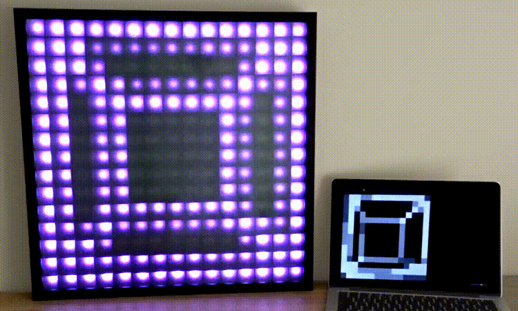
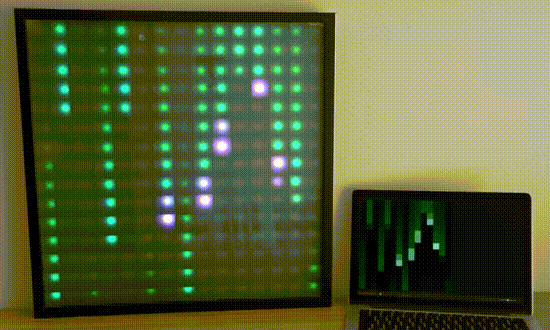
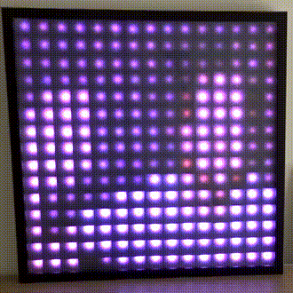

# Canvas Cast Matrix
Cast any `<canvas>` element to an LED Matrix over WebSockets with an Arduino/ESP8266.

Bring your HTML canvas projects into the real world by streaming them in realtime over WiFi to an LED Matrix, using an Arduino compatable board with WiFi, such as the ESP8266.


## Features:
 - Stream any canvas element
 - 2D or 3D(WebGL)
 - Supports all popular LED types (powered by [FastLED](https://github.com/FastLED/FastLED))
 - Matrix brightness control
 - Matrix status pixel


## Examples
### [3D WebGL](examples/3D-cube.html)

### [p5js (Matrix rain)](examples/matrix.html)

### [Webcam streaming](examples/webcam.html)


## Getting started setup
In this example setup we're using:
* ESP8266 NodeMCU
* 15x15 RGB LED matrix (WS2812B)
* 5V 10A PSU
* Laptop & home wifi

### Arduino/ESP8266
1. Open the Arduino sketch file and edit the following settings:
```c
// Wifi SSID and password
const char* ssid = "NetworkName";
const char* password = "wifipassword";
// Matrix size
const uint8_t kMatrixWidth = 15;
const uint8_t kMatrixHeight = 15;
// Matrix settings
#define LED_PIN 3
#define COLOR_ORDER GRB
#define CHIPSET WS2812B
```
2. Upload sketch to ESP8266.
3. Open console monitor and take note of ESP8266's IP address. (or check your Wifi route)
4. On the Matrix, pixel zero(status pixel) will flash orange while it connects to Wifi, once connected it will pluse green to indacate it is ready.

### Web interface
1. Open src/index.html and edit the following config found at the top of the document.
WS port will be 81 unless you changed it in the Arduino sketch.
```javascript
// Config
const matrix = {
  // Matrix IP & port of ESP8266
  ip: '192.168.1.65:81',
  // Matrix pixel size
  width: 15,
  height: 15,
};
```
2. Run the local development environment and check the status bar and [Matrix status pixel](./arduino/README.md).  
`npm install`  
`npm run start`
3. See _/examples_ for some simple examples.
